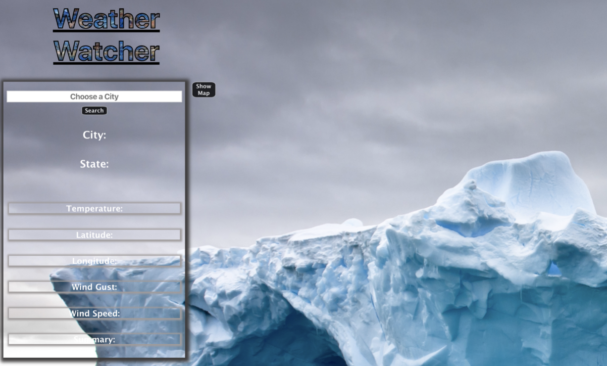

A 1-day hackathon collaboration project where a group of students built a rails backend to communicate with my React.js frontend given a specific theme. 

## Video Walk Through

* [Walk Through Video]()

## Motivation

During the last stages of the Flatiron School software engineering program, students from the React module team up with a pair of students in the early Ruby/Rails module to build a full-stack application from start to finish in 5 hours. Teams follow a specific theme and collborate using github best practices and a simple agile workflow. The theme of this application was things of large magnitude. Our team decided to create a simple SPA to pull weather data from NASA and display various weather stats depending on location. 

## Getting Started

If you wish to fork/clone the repo, do so in conjunction with the backend found at [Back End Repo](https://github.com/miriamgrigsby/hackathon-back). 

### Tech Stack

Ruby on Rails with a SQLite3 Database backend

React.js frontend

### Installation

The app front is built with React which requires the following commands to run: 

    Run npm start
    
The app back is built in Ruby on Rails with a SQLite3 database

    Run bundle 
    
    Run rails:db migrate
    
    Run rails db:seed
    
    Run rails s 
    
### Dependencies

There are no dependencies for this application. 
 
### Features

The main features of the app include clicking on the show map button to toggle the map, clicking locations to display weather information, or using the filter input to filter by location without using the map. 

### Operation Overview

From the landing page, click on the show map button to display the interactive map. Clicking this button back and forth will toggle the map's display. From here, the user can click on the listed locations to display simple weather data from the NASA API. The user can alternatively filter for location using the filter nav bar at the top. 

 

	
